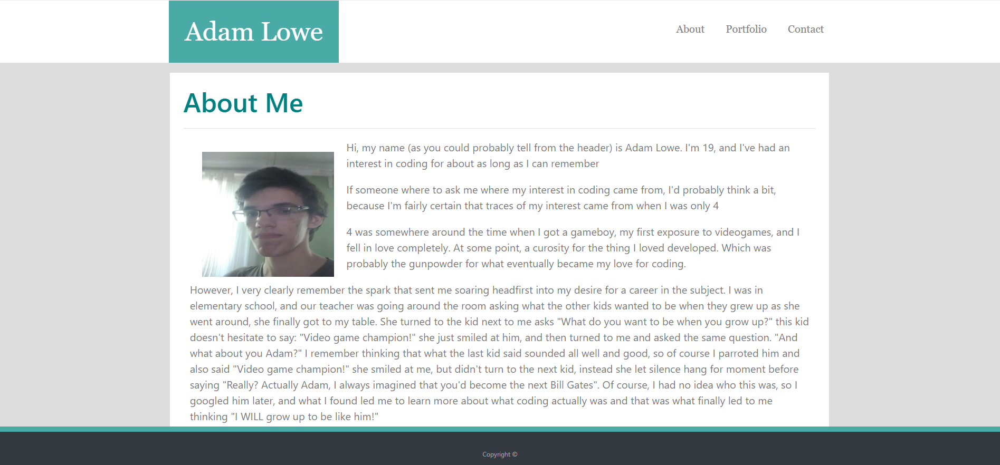
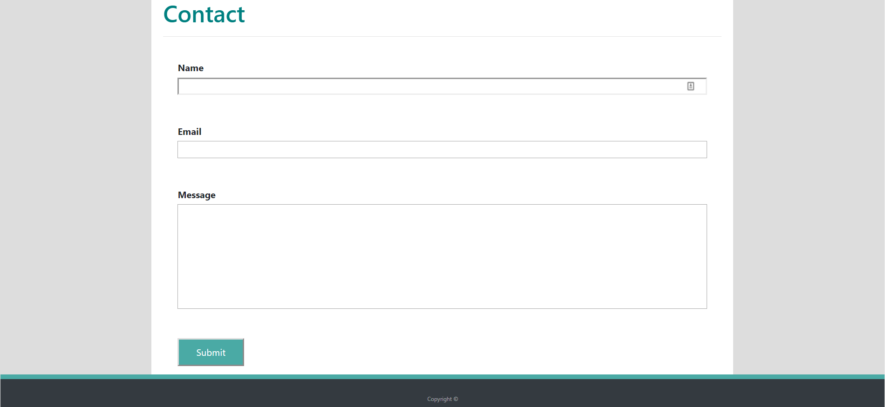
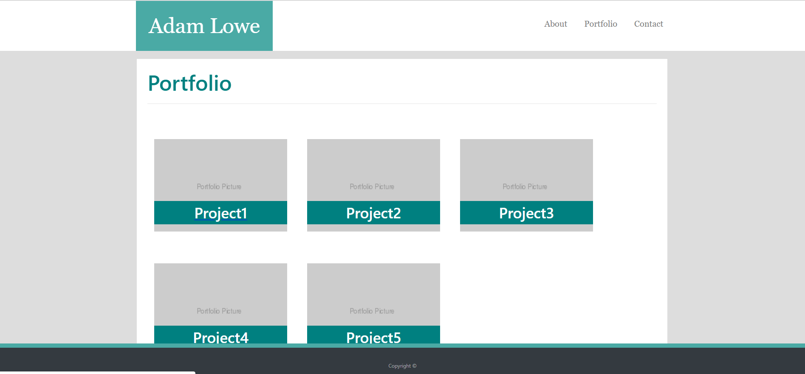

# Homework 2 - Responsive Portfolio

This repo is for the UNCC coding bootcamp's second homework assignment

## Instructions

Recreate the page from first homework assignment except using bootstrap 4 to make it a much more responsive website

## Screenshots

   

   

   

### Links

[Github Repo](https://github.com/Goldpm/HW2-Responsive-Portfolio)
[Completed Work](https://goldpm.github.io/HW2-Responsive-Portfolio/)
